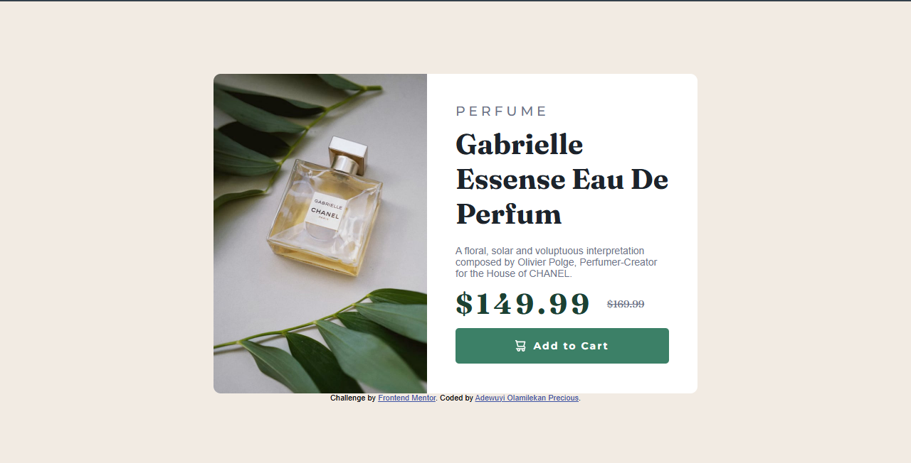

# Frontend Mentor - Product preview card component solution

This is a solution to the [Product preview card component challenge on Frontend Mentor](https://www.frontendmentor.io/challenges/product-preview-card-component-GO7UmttRfa). Frontend Mentor challenges help you improve your coding skills by building realistic projects. 

## Table of contents

- [Overview](#overview)
  - [The challenge](#the-challenge)
  - [Screenshot](#screenshot)
  - [Links](#links)
- [My process](#my-process)
  - [Built with](#built-with)
  - [What I learned](#what-i-learned)
  - [Continued development](#continued-development)
  - [Useful resources](#useful-resources)
- [Author](#author)

## Overview

### The challenge
The biggest challenge I faced in this project was ensuring the layout looked good across different devices. I had to focus on responsiveness so the design could adapt smoothly whether viewed on a phone, tablet, or desktop.
Another key task was adding hover and focus states to the button. This was important because it made the page feel more interactive and gave users clear feedback when they were about to click.

### Screenshot

### Links
- Solution URL: [Add solution URL here](https://github.com/OlamilekanAdewuyi/Perfume.git)
- Live Site URL: [Add live site URL here](https://perfume026.netlify.app/)

## My process

### Built with
- CSS custom properties
- Flexbox

### What I learned
From this project, I learned how to structure HTML and apply CSS to achieve a clean, well-organized design. I also got hands-on practice creating a button that included both text and an icon, which helped me better understand how to align elements within a button.

I also improved my skills in handling responsiveness. By using media queries, I was able to adjust the layout for smaller screens, for example, stacking elements and resizing fonts so the page still looked appealing. This experience really highlighted the importance of considering different devices when building a webpage.

Below are the code snippets;

html
      <button>
          
          <h4>Add to Cart</h4>
        </button>

css
@media screen and (max-width: 600px) {
    body {
        padding: 20px;
    }

    .content {
        flex-direction: column;
        height: auto;
    }

    .image1 {
        width: 100%;
        height: 30vh; /* takes 30% of screen height */
        object-fit: cover;
        border-radius: 10px 10px 0 0;
        display: none;
    }
    .image2{
        width: 100%;
        height: 30vh; /* takes 30% of screen height */
        object-fit: cover;
        border-radius: 10px 10px 0 0;
        display: block;
    }

    .image-text {
        padding: 20px;
    }

    h2 {
        font-size: 28px;
    }

    .amount h4 {
        font-size: 28px;
    }
}

### Continued development
In future projects, I want to keep building my skills in responsiveness by practicing how layouts adapt seamlessly across various screen sizes. I also plan to refine my use of media queries to manage multiple breakpoints more effectively, ensuring the design stays consistent and visually appealing on both small and large devices.

### Useful resources
- [W3schools](https://www.w3schools.com/css/css3_mediaqueries.asp) - This was really helpful in fine-tuning the details of my media queries and making sure everything looked just right.
- [W3schools](https://www.w3schools.com/css/css_rwd_intro.asp) - This helped me get the right details to make my project responsive across different devices.
- [Youtube](https://www.youtube.com/watch?v=n9yI6fjkrfE&t=10s) - By watching some YouTube videos, I was able to understand what media queries are and how they work to make a design responsive.

## Author
- Frontend Mentor - [@Olamilekan](https://www.frontendmentor.io/profile/OlamilekanAdewuyi)
- Twitter - [@olamilekan_lcc](https://x.com/Olamilekan_lcc?t=bqsjVbUEQQjksZTp4RRb_Q&s=09)
